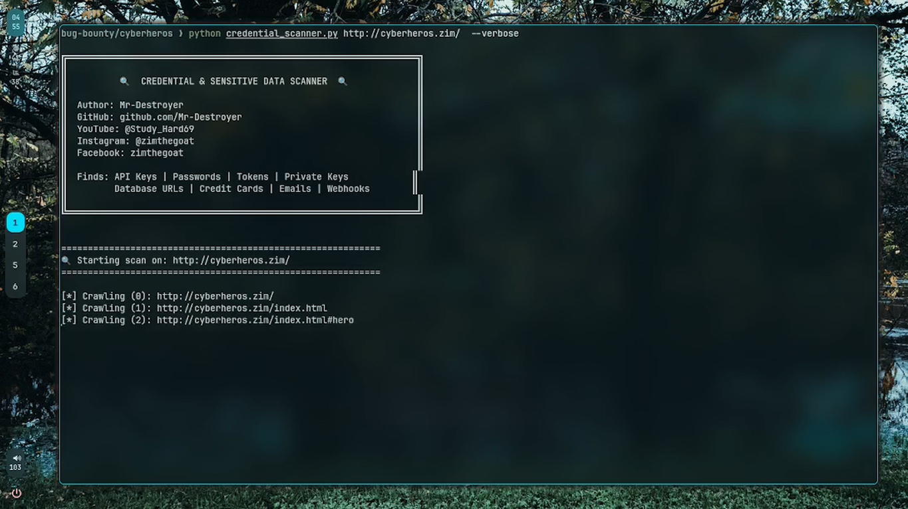
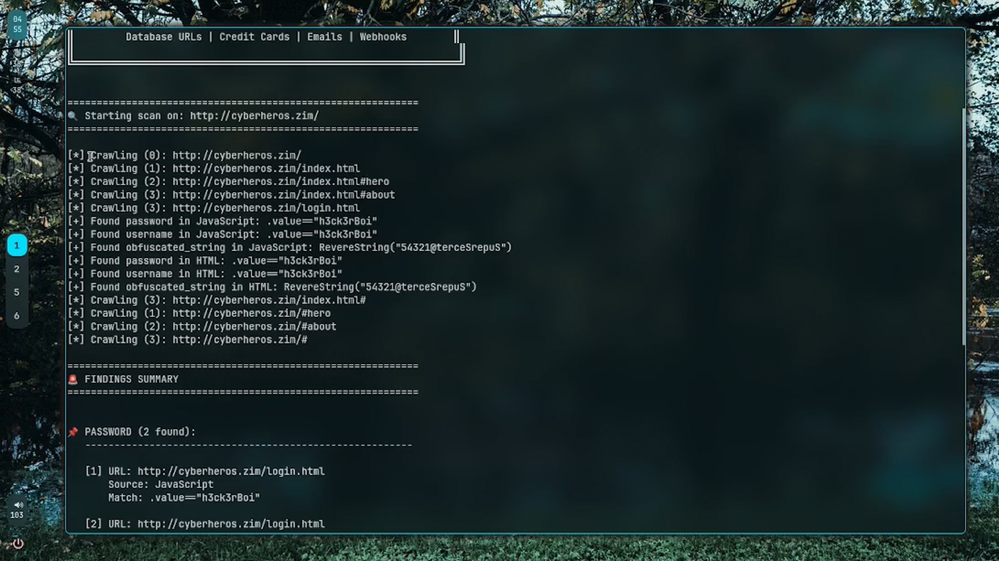
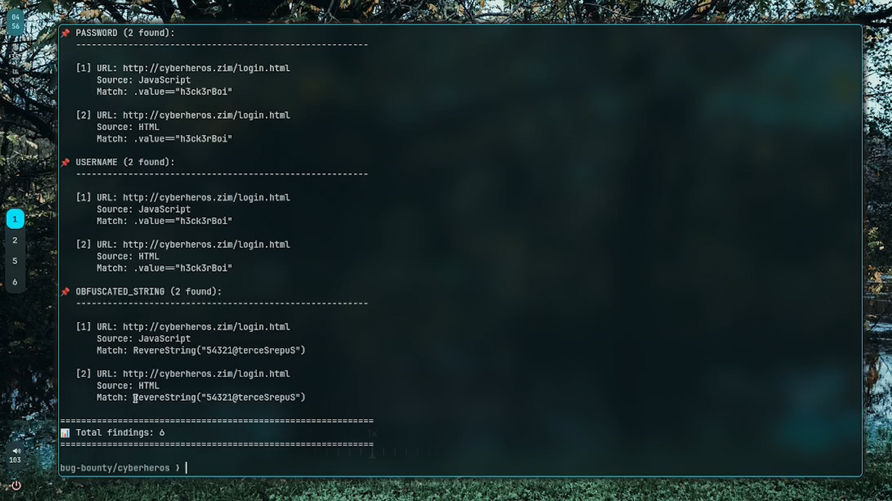

# 🔍 Credential & Sensitive Data Scanner

A powerful Python tool that crawls websites and automatically detects exposed credentials, API keys, passwords, tokens, and other sensitive data. Perfect for security audits, bug bounty hunting, and penetration testing.


---

## 📸 Screenshots

### 1. Scanner Banner & Crawling Process

*Shows the beautiful banner with author info and the crawling process in verbose mode*

### 2. Verbose Mode - Real-time Detection

*Demonstrates verbose mode showing each URL being crawled and sensitive data being found in real-time*

### 3. Findings Summary Report

*Detailed findings report showing detected passwords, usernames, and obfuscated strings with their locations*

---

## ✨ Features

- 🔐 **Multi-Type Detection**: Finds API keys, passwords, usernames, bearer tokens, database URLs, private keys, AWS keys, emails, credit cards, and more
- 🕷️ **Web Crawler**: Automatically crawls websites following links (with configurable depth)
- 📄 **Deep Content Analysis**: Scans HTML, JavaScript, and HTML comments for sensitive data
- 🎯 **Regex-Based Patterns**: Uses industry-standard patterns to detect various credential formats
- 📊 **Detailed Reporting**: Clear, formatted output with findings organized by type
- 💾 **Export Functionality**: Save results to JSON for further analysis
- 🔄 **Same-Domain Crawling**: Only crawls within the target domain for scope compliance
- 🚀 **Performance Optimized**: Efficient crawling with configurable depth limits
- 🔇 **Verbose Mode**: Optional detailed logging for debugging

---

## 🎯 Detection Capabilities

| Category | What It Detects |
|----------|-----------------|
| **API Keys** | API keys and tokens (20+ character variants) |
| **Passwords** | Hardcoded passwords and password fields |
| **Usernames** | Usernames, admin accounts, login credentials |
| **Bearer Tokens** | Authentication tokens and bearer tokens |
| **Database URLs** | MongoDB URIs, SQL connection strings |
| **Private Keys** | RSA, EC, and other private key formats |
| **AWS Keys** | AWS Access Key IDs (AKIA format) |
| **Emails** | Email addresses across all pages |
| **Credit Cards** | 16-digit credit card numbers (masked formats) |
| **Webhooks** | Webhook URLs and hook endpoints |
| **Obfuscated Strings** | Encoded/reversed strings in JavaScript |

---

## 📋 Requirements

- Python 3.7 or higher
- Internet connection
- Target website must be accessible

---

## 🚀 Installation

### 1. Clone the Repository
```bash
git clone https://github.com/Mr-Destroyer/credential-scanner.git
cd credential-scanner
```

### 2. Install Dependencies
```bash
pip install -r requirements.txt
```

Or install manually:
```bash
pip install requests beautifulsoup4
```

---

## 💻 Usage

### Basic Scan
```bash
python credential_scanner.py http://example.com
```

### Advanced Usage

#### Customize Crawl Depth
```bash
# Scan up to 5 levels deep (default is 3)
python credential_scanner.py http://example.com --depth 5
```

#### Enable Verbose Mode
```bash
# See detailed output of every URL being crawled
python credential_scanner.py http://example.com --verbose
```

#### Export Results to JSON
```bash
# Save findings to a JSON file for analysis
python credential_scanner.py http://example.com --export findings.json
```

#### Combine Options
```bash
# Full scan with all options
python credential_scanner.py http://example.com --depth 5 --verbose --export findings.json
```

### Command Line Arguments

| Argument | Description | Default |
|----------|-------------|---------|
| `<url>` | **Required.** Target website URL | - |
| `--depth <N>` | Maximum crawl depth | 3 |
| `--verbose` | Enable detailed logging | Disabled |
| `--export <filename>` | Export findings to JSON file | None |

---

## 📊 Output Examples

### Console Output
```
════════════════════════════════════════════════════════
🔍 Starting scan on: http://example.com
════════════════════════════════════════════════════════

════════════════════════════════════════════════════════
🚨 FINDINGS SUMMARY
════════════════════════════════════════════════════════

📌 API_KEY (2 found):
   ────────────────────────────────────────────────────

   [1] URL: http://example.com/admin/config.js
       Source: JavaScript
       Match: api_key = "sk_live_1234567890abcdef"

   [2] URL: http://example.com/api/settings
       Source: HTML
       Match: apikey: "AIzaSyD1234567890abcdef"

════════════════════════════════════════════════════════
📊 Total findings: 2
════════════════════════════════════════════════════════
```

### JSON Export Format
```json
{
  "api_key": [
    {
      "url": "http://example.com/admin/config.js",
      "type": "api_key",
      "match": "api_key = \"sk_live_1234567890abcdef\"",
      "source": "JavaScript"
    }
  ],
  "password": [
    {
      "url": "http://example.com/login",
      "type": "password",
      "match": "password = \"SecurePass123\"",
      "source": "HTML"
    }
  ]
}
```

---

## 🔒 Security & Ethical Considerations

⚠️ **IMPORTANT**: This tool should ONLY be used on websites you own or have explicit permission to test.

- **Authorized Testing Only**: Only scan websites you have permission to test
- **Responsible Disclosure**: If you find real credentials, report them responsibly to the website owner
- **No Malicious Use**: Do not use this tool for unauthorized access or illegal purposes
- **Data Handling**: Be careful with exported findings - they may contain sensitive information

---

## 🛠️ How It Works

1. **Initialization**: Scanner creates a session with a spoofed user agent
2. **Crawling**: Starts from the target URL and follows internal links up to max depth
3. **Content Analysis**: 
   - Extracts JavaScript from `<script>` tags
   - Scans HTML comments
   - Analyzes all HTML content
4. **Pattern Matching**: Uses regex patterns to identify sensitive data types
5. **Reporting**: Compiles findings and displays them in a formatted report
6. **Export** (Optional): Saves results to JSON for further analysis

---

## 📝 Examples

### Example 1: Basic Website Scan
```bash
$ python credential_scanner.py http://vulnerable-app.local
```

### Example 2: Deep Penetration Testing Scan
```bash
$ python credential_scanner.py http://target.com --depth 5 --verbose --export pentest_results.json
```

### Example 3: Quick Check with Export
```bash
$ python credential_scanner.py https://api.example.com --export api_findings.json
```

---

## 🐛 Troubleshooting

### Issue: SSL Certificate Verification Errors
**Solution**: The tool disables SSL verification by default. If you need to enable it, modify the `verify=False` parameter in the `_crawl_url` method.

### Issue: Timeout Errors
**Solution**: Increase the timeout value or reduce the crawl depth:
```bash
python credential_scanner.py http://example.com --depth 2
```

### Issue: No Results Found
**Solution**: 
- Try increasing the depth: `--depth 5`
- Enable verbose mode to see crawling progress: `--verbose`
- Ensure the target has JavaScript or sensitive content

### Issue: ModuleNotFoundError
**Solution**: Install required dependencies:
```bash
pip install requests beautifulsoup4
```

---

## 📦 Requirements File

**requirements.txt**
```
requests>=2.28.0
beautifulsoup4>=4.11.0
```

---

## 🗂️ Project Structure

```
credential-scanner/
├── credential_scanner.py      # Main scanner script
├── requirements.txt           # Python dependencies
├── README.md                  # This file
└── findings.json              # Sample output (generated)
```

---

## 🤝 Contributing

Contributions are welcome! To contribute:

1. Fork the repository
2. Create a feature branch (`git checkout -b feature/amazing-feature`)
3. Commit your changes (`git commit -m 'Add amazing feature'`)
4. Push to the branch (`git push origin feature/amazing-feature`)
5. Open a Pull Request

---

## 📄 License

This project is licensed under the MIT License - see the LICENSE file for details.

---

## 👨‍💻 Author

**Mr-Destroyer**

- 🐙 GitHub: [@Mr-Destroyer](https://github.com/Mr-Destroyer)
- 📺 YouTube: [@Study_Hard69](https://www.youtube.com/@Study_Hard69)
- 📸 Instagram: [@zimthegoat](https://www.instagram.com/zimthegoat)
- 👥 Facebook: [zimthegoat](https://www.facebook.com/zimthegoat)

---

## ⚠️ Disclaimer

This tool is provided for educational and authorized security testing purposes only. Users are responsible for ensuring they have proper authorization before scanning any website. Unauthorized access to computer systems is illegal. The author is not responsible for misuse of this tool.

---

## 📞 Support

- Found a bug? Open an issue on GitHub
- Have questions? Check the troubleshooting section above
- Want to suggest a feature? Create a GitHub issue

---

## 🔗 Related Resources

- [OWASP Top 10](https://owasp.org/www-project-top-ten/)
- [Bug Bounty Hunting Guide](https://www.bugcrowd.com/)
- [Penetration Testing Guide](https://www.kali.org/)

---

**Happy hunting! 🎯**

Last Updated: 2024
