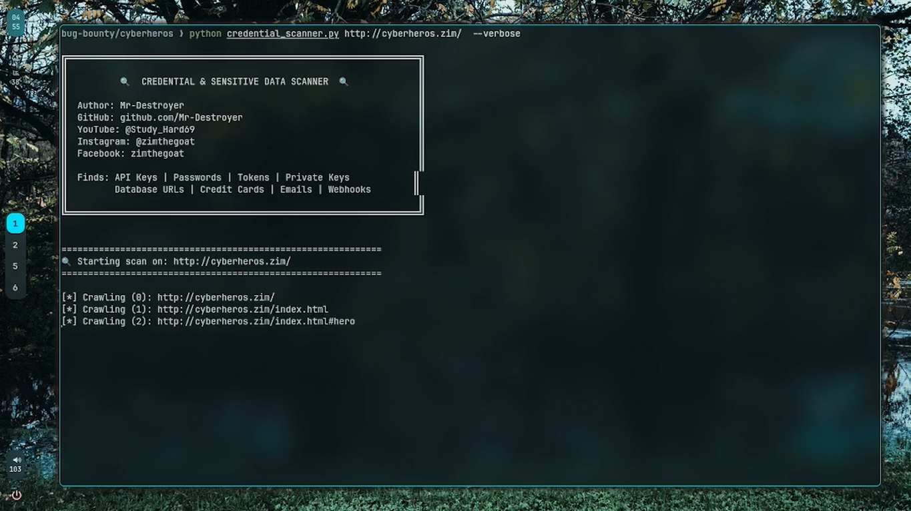
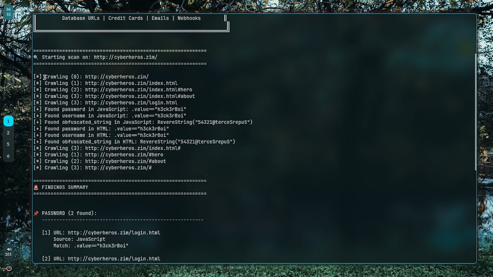
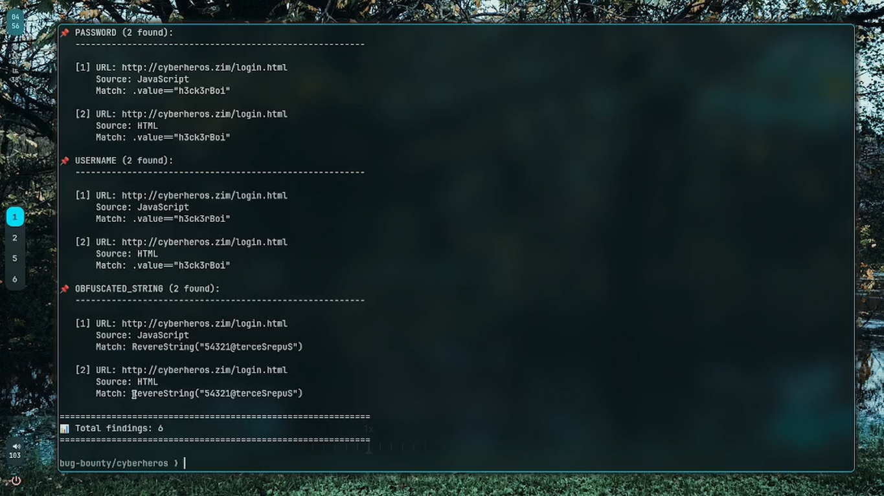

<div align="center">

```
   ____              _ ____  _        _ _
  / ___|_ __ ___  __| / ___|| |_ __ _| | | _____ _ __
 | |   | '__/ _ \/ _` \___ \| __/ _` | | |/ / _ \ '__|
 | |___| | |  __/ (_| |___) | || (_| | |   <  __/ |
  \____|_|  \___|\__,_|____/ \__\__,_|_|_|\_\___|_|
```

# CredStalker

**Hunt exposed credentials before attackers do.**

_Crawl a site. Find API keys, passwords, tokens, private keys, DB URLs and more — in HTML, JS and comments._

[](https://www.python.org/)
[](./src/credstalker/__init__.py)
[](./LICENSE)
[](https://github.com/Mr-Destroyer/CredStalker-/pulls)

[Features](#-features) • [Detection](#-what-it-detects) • [Install](#-installation) • [Usage](#-usage) • [Screenshots](#-screenshots) • [Structure](#️-project-structure) • [Contributing](#-contributing)

</div>

---

## 📑 Table of Contents

- [✨ Features](#-features)
- [🎯 What It Detects](#-what-it-detects)
- [📸 Screenshots](#-screenshots)
- [⚡ Installation](#-installation)
- [💻 Usage](#-usage)
- [📊 Output](#-output)
- [🗂️ Project Structure](#️-project-structure)
- [🛠️ How It Works](#️-how-it-works)
- [🔒 Ethics & Scope](#-ethics--scope)
- [🐛 Troubleshooting](#-troubleshooting)
- [🗺️ Roadmap](#️-roadmap)
- [🤝 Contributing](#-contributing)
- [👨‍💻 Author](#-author)
- [📄 License](#-license)

---

## ✨ Features

| | Capability |
|---|---|
| 🕷️ | **Scoped crawler** — follows same-domain links up to `--depth`, with `--max-urls`, `--delay` and `--timeout` guards |
| 📜 | **JS-aware** — scans inline `<script>` blocks, fetches linked `.js` files, plus HTML comments and full HTML |
| 🔐 | **17 detectors** — generic keys plus OpenAI, GitHub, Slack, Google, Stripe, JWT, DB URLs, private keys, AWS, webhooks… |
| 🎨 | **Rich banner + report** — color `Panel` banner and severity table, with `--no-color` / `--silent` for CI |
| 💾 | **JSON export** — machine-readable `--export findings.json` for pipelines and bug-bounty notes |
| 🧩 | **Clean package** — `src/credstalker/` modules, `credstalker` console script, `python -m credstalker`, legacy `credential_scanner.py` shim |
| 🧪 | **Tested** — `pytest` pattern + crawler scope tests |

---

## 🎯 What It Detects

| Category | Severity | What It Detects |
|---|---|---|
| OpenAI Key | `CRITICAL` | `sk-…`, `sk-proj-…` |
| GitHub Token | `CRITICAL` | `ghp_…`, `gho_…`, `ghu_…`, `ghs_…`, `ghr_…` |
| Slack Token | `CRITICAL` | `xoxb-…`, `xoxp-…`, `xoxa-…`, `xoxr-…`, `xoxs-…` |
| Stripe Key | `CRITICAL` | `sk_live_…`, `pk_live_…`, `rk_live_…` (+ test) |
| Password | `CRITICAL` | `password/passwd/pwd = …`, hardcoded `.value == …` |
| Database URL | `CRITICAL` | `mongodb://`, `postgres://`, `mysql://`, `redis://` + config keys |
| Private Key | `CRITICAL` | `-----BEGIN … PRIVATE KEY-----` blocks |
| AWS Key | `CRITICAL` | `AKIA…` + secret-pair heuristic |
| API Key | `HIGH` | Generic `api_key / apikey / api_token` (20+ char) |
| Google API Key | `HIGH` | `AIza…` (35 chars) |
| JWT | `HIGH` | `eyJ…eyJ…signature` |
| Bearer Token | `HIGH` | `Bearer …` + `token/auth = …` |
| Credit Card | `HIGH` | 16-digit `4111-1111-1111-1111` variants |
| Username | `MEDIUM` | `username/user/login`, `admin/root` |
| Webhook URL | `MEDIUM` | Discord / Slack webhook URLs + generic `webhook_url` |
| Obfuscated String | `MEDIUM` | `atob/btoa/decode/reverse(…)` tricks in JS |
| Email | `LOW` | PII / enumeration surface |

> False positives are possible (especially `username`, `email`). Triage before reporting.

---

## 📸 Screenshots

| Banner & Crawl | Verbose Detection | Findings Report |
|---|---|---|
|  |  |  |
| New Rich `Panel` banner with version + scope line | `--verbose` shows every URL + live `[+] Found …` hits | Severity table grouped by type with URL + match |

---

## ⚡ Installation

**Requirements:** Python 3.8+, internet access, permission to scan the target.

```bash
# 1. Clone
git clone https://github.com/Mr-Destroyer/CredStalker-.git
cd CredStalker-

# 2. Install (pick one)
pip install -r requirements.txt      # runtime only
pip install -e ".[dev]"              # + credstalker command + pytest

# 3. Verify
credstalker --version
# or without install:
python -m credstalker --version
python credential_scanner.py --version
```

---

## 💻 Usage

```bash
# Basic scan
credstalker https://example.com

# Deep + verbose + export
credstalker https://example.com --depth 5 --verbose --export findings.json

# Bug-bounty style: slow, wide, subdomain scope
credstalker https://target.com --depth 4 --max-urls 500 --delay 0.3 \
  --include-subdomains --timeout 10 --export bounty.json

# CI / automation: no colors, no banner
credstalker https://staging.internal --silent --no-color --export ci.json

# Legacy shim still works
python credential_scanner.py https://example.com --depth 3 --verbose
```

### CLI reference

```
credstalker <url> [options]

  --depth N              Max crawl depth (default: 3)
  --verbose              Show every URL crawled + live hits
  --export FILE          Write findings to JSON
  --timeout SEC          Per-request timeout (default: 8)
  --max-urls N           Max pages + JS assets to fetch (default: 200)
  --delay SEC            Delay between requests (default: 0)
  --user-agent STR       Custom User-Agent
  --include-subdomains   Crawl subdomains too (default: exact domain only)
  --silent               Suppress console report (for scripts)
  --no-color             Disable Rich colors
  --version              Show version and exit
```

---

## 📊 Output

**Console (Rich table):**

```
🚨 FINDINGS SUMMARY
┏━━━┳━━━━━━━━━━━━┳━━━━━━━━━━┳━━━━━━━━━━━━┳━━━━━━━━━━━━━━━━━┳━━━━━━━━━━━━━━━━━━┓
┃ # ┃ Type       ┃ Severity ┃ Source     ┃ URL             ┃ Match            ┃
┡━━━╇━━━━━━━━━━━━╇━━━━━━━━━━╇━━━━━━━━━━━━╇━━━━━━━━━━━━━━━━━╇━━━━━━━━━━━━━━━━━━┩
│ 1 │ API Key    │ HIGH     │ JavaScript │ …/static/app.js │ api_key = "sk…"  │
│ 2 │ Password   │ CRITICAL │ HTML       │ …/login         │ password = "…"   │
└───┴────────────┴──────────┴────────────┴─────────────────┴──────────────────┘
📊 Total findings: 2
```

**JSON (`--export findings.json`, see [`examples/sample_findings.json`](./examples/sample_findings.json)):**

```json
{
  "api_key": [
    {
      "url": "http://example.com/static/config.js",
      "type": "api_key",
      "match": "api_key = \"sk_live_1234567890abcdef\"",
      "source": "JavaScript"
    }
  ]
}
```

---

## 🗂️ Project Structure

```
CredStalker-/
├── src/credstalker/        # installable package
│   ├── __init__.py         # version + exports
│   ├── __main__.py         # python -m credstalker
│   ├── banner.py           # Rich banner + ANSI fallback
│   ├── patterns.py         # PATTERNS + PATTERN_META (severity)
│   ├── scanner.py          # CredentialScanner (crawl + detect)
│   ├── reporter.py         # Rich table / plain report
│   └── cli.py              # argparse entry point
├── tests/
│   ├── test_patterns.py    # every detector fires on a sample
│   └── test_scanner.py     # scope + dedup + export (mocked HTTP)
├── assets/                 # screenshots
├── examples/
│   └── sample_findings.json
├── credential_scanner.py   # legacy shim → credstalker.cli:main
├── pyproject.toml          # build + `credstalker` script
├── requirements.txt
├── LICENSE
└── README.md
```

---

## 🛠️ How It Works

1. **Init** — session with browser-like UA, pre-compiled regexes, scope = target domain (or + subdomains).
2. **Crawl** — BFS from seed URL up to `--depth` / `--max-urls`; same-scope `<a href>` links are followed.
3. **JS surface** — inline `<script>` blocks are scanned; linked `script[src]` files are fetched and scanned without costing depth.
4. **Match** — content (JS → comments → full HTML) is checked against all patterns with per-URL dedup.
5. **Report** — Rich severity table (or plain fallback) + optional JSON export.

---

## 🔒 Ethics & Scope

> ⚠️ **Authorized testing only.** Scan only sites you own or have explicit written permission to test.

- Default scope is **exact domain only** — use `--include-subdomains` deliberately.
- Respect `robots.txt`, rate limits and program rules; use `--delay` on shared targets.
- Handle exports as secrets — `findings.json` can contain live credentials. Delete or vault it.
- Disclose responsibly to the asset owner. Never use findings for unauthorized access.

---

## 🐛 Troubleshooting

| Symptom | Fix |
|---|---|
| `ModuleNotFoundError` | `pip install -r requirements.txt` or `pip install -e .` |
| `credstalker: command not found` | Use `python -m credstalker …` or reinstall with `pip install -e .` |
| SSL / timeout errors | Raise `--timeout 15`, lower `--depth 2`, add `--delay 0.5` |
| No results | Try `--depth 5 --verbose`, check the target actually serves JS / comments |
| Too many requests | Lower `--max-urls 50`, add `--delay`, avoid `--include-subdomains` initially |
| Colors broken in CI | Add `--no-color --silent` |

---

## 🗺️ Roadmap

- [ ] HTML report (`--format html`) + SARIF for GitHub code scanning
- [ ] JS entropy detector for unknown secret shapes
- [ ] `robots.txt` / `sitemap.xml` seeding + `--exclude` regex
- [ ] Concurrent fetching with per-host throttling

PRs and issues welcome.

---

## 🤝 Contributing

1. Fork → `git checkout -b feature/amazing-feature`
2. `pip install -e ".[dev]"` → `pytest -q`
3. Commit → push → open a PR

Please keep new detectors in `src/credstalker/patterns.py` with a sample in `tests/test_patterns.py`.

---

## 👨‍💻 Author

**Mr-Destroyer**

- 🐙 GitHub: [@Mr-Destroyer](https://github.com/Mr-Destroyer)
- 📺 YouTube: [@Study_Hard69](https://www.youtube.com/@Study_Hard69)
- 📸 Instagram: [@zimthegoat](https://www.instagram.com/zimthegoat)
- 👥 Facebook: [zimthegoat](https://www.facebook.com/zimthegoat)

---

## 📄 License

MIT — see [LICENSE](./LICENSE).

> **Disclaimer:** for educational and authorized security testing only. You are responsible for having proper authorization. Unauthorized access is illegal. The author is not responsible for misuse.

---

<div align="center">

**Happy hunting! 🎯**

⭐ Star the repo if CredStalker helped your audit.

</div>
